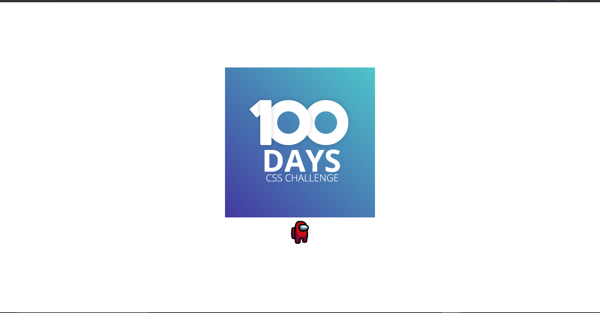
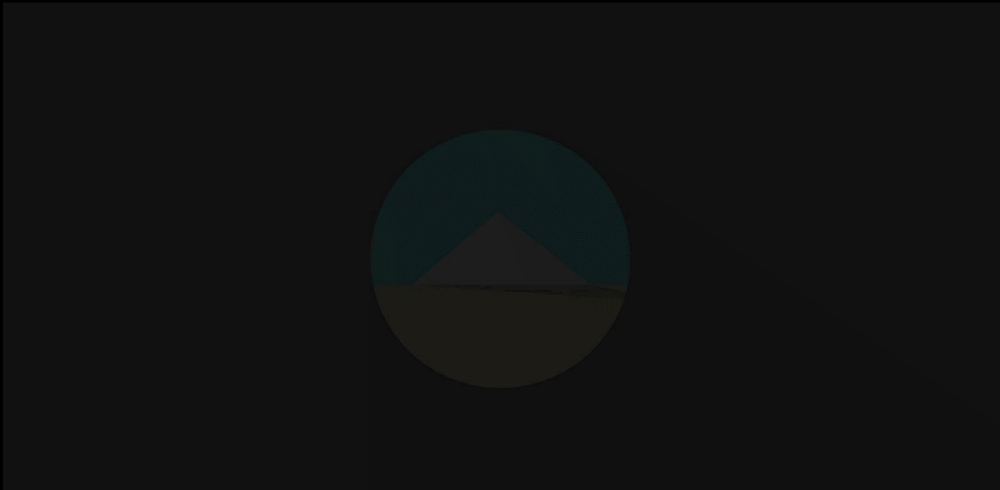
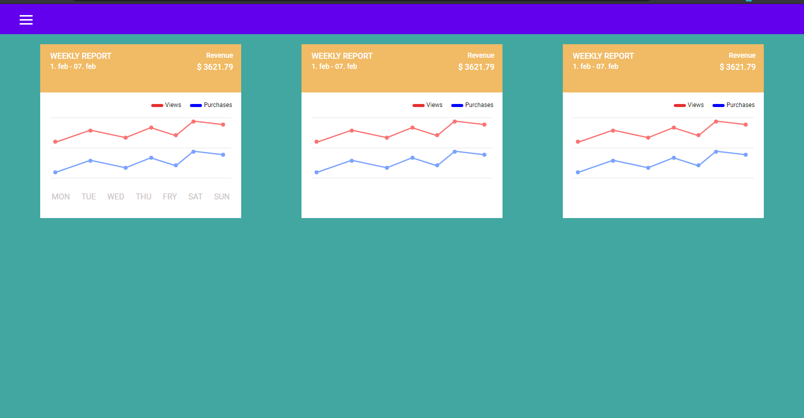
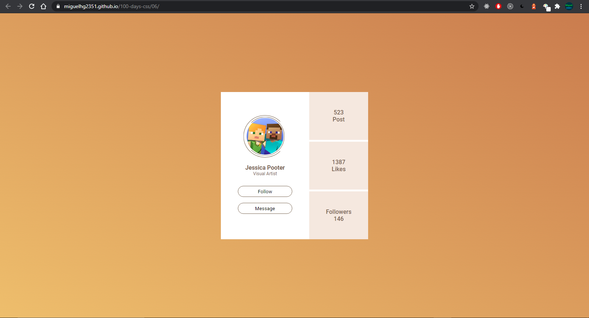
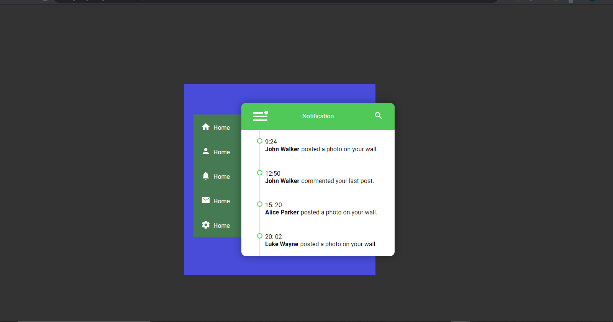
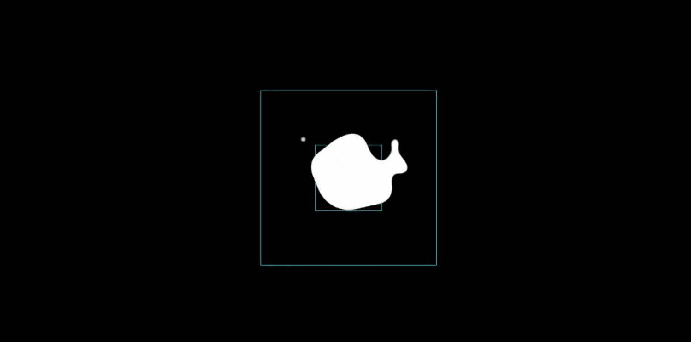
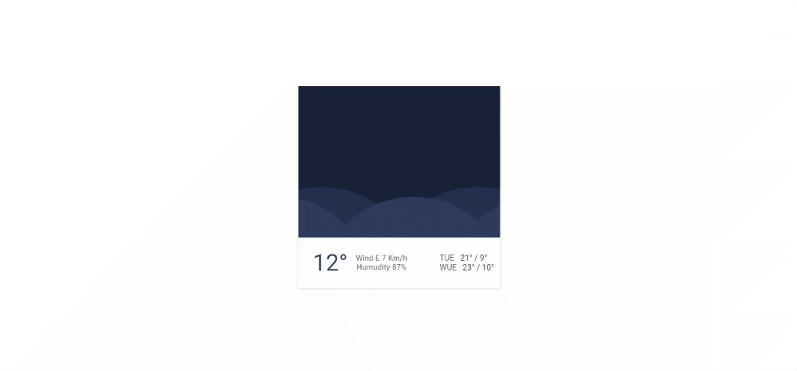
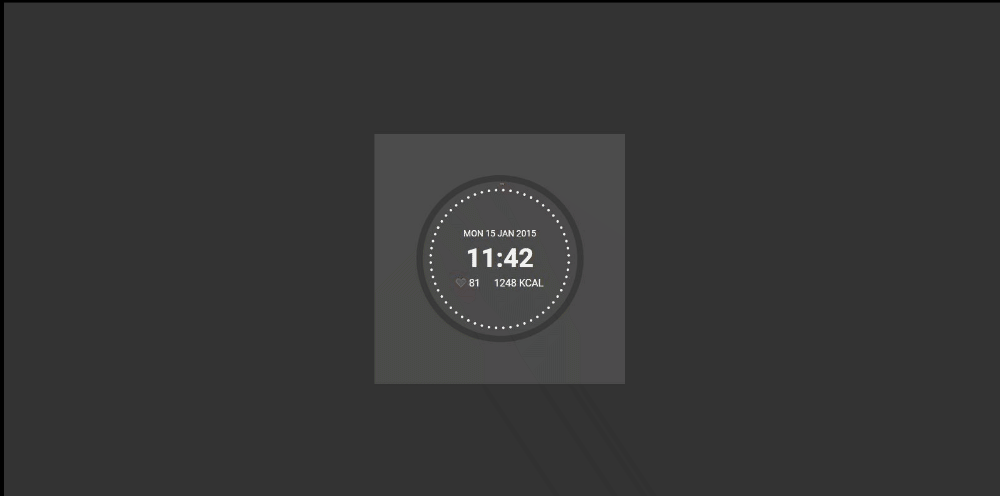
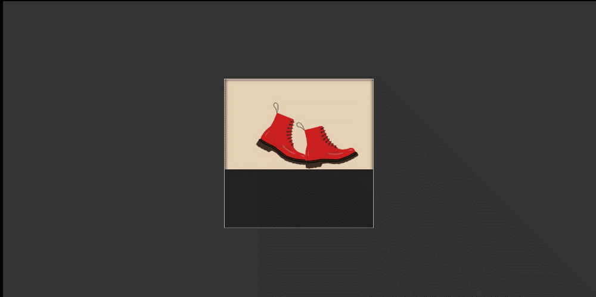
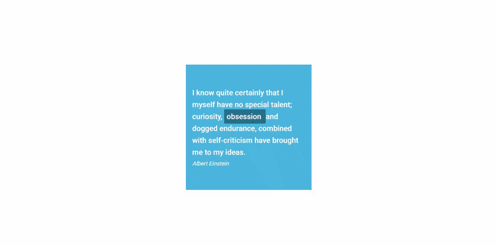

# Día 1

Se utilizo:

- -webkit-fill-available, alternativa a fit-content
- [filter: progid:DXImageTransform.Microsoft.gradient](https://docs.microsoft.com/en-us/previous-versions/windows/internet-explorer/ie-developer/platform-apis/ms532997(v=vs.85))



[DEMO](https://miguelhg2351.github.io/100-days-css/01)

# Día 2

se utilizo:

- Animaciones básicas y la función ```css rotate()```


[DEMO](https://miguelhg2351.github.io/100-days-css/02)

# Día 3

se utilizo:

- [clip-path](https://developer.mozilla.org/es/docs/Web/CSS/clip-path)

- [Cubic bezier](https://developer.mozilla.org/en-US/docs/Web/CSS/easing-function)

- [Animaciones](https://developer.mozilla.org/es/docs/Web/CSS/animation)



[DEMO](https://miguelhg2351.github.io/100-days-css/03)

# Día 4

- [Animaciones](https://developer.mozilla.org/es/docs/Web/CSS/animation)
- [scale](https://developer.mozilla.org/es/docs/Web/CSS/transform-function/scale)


[DEMO](https://miguelhg2351.github.io/100-days-css/04)

# Día 5

- [Animaciones](https://developer.mozilla.org/es/docs/Web/CSS/animation)

- [Pseudo elementos](https://developer.mozilla.org/es/docs/Web/CSS/Pseudoelementos)



[DEMO](https://miguelhg2351.github.io/100-days-css/05)

# Día 6

- [Animaciones](https://developer.mozilla.org/es/docs/Web/CSS/animation)

- [Animaciones](https://developer.mozilla.org/es/docs/Web/CSS/animation)



[DEMO](https://miguelhg2351.github.io/100-days-css/06)

# Día 7

- [SVG](https://developer.mozilla.org/es/docs/Web/SVG)

- [CSS y SVG](https://developer.mozilla.org/en-US/docs/Web/SVG/Tutorial/SVG_and_CSS)



[DEMO](https://miguelhg2351.github.io/100-days-css/07)

# Día 8

- [SVG](https://developer.mozilla.org/es/docs/Web/SVG)

- [Animaciones](https://developer.mozilla.org/es/docs/Web/CSS/animation)

- [Pseudo elementos](https://developer.mozilla.org/es/docs/Web/CSS/Pseudoelementos)

- [Filter CSS](https://developer.mozilla.org/es/docs/Web/CSS/filter)



[DEMO](https://miguelhg2351.github.io/100-days-css/08)

# Día 9

- [Animaciones](https://developer.mozilla.org/es/docs/Web/CSS/animation)

- [Pseudo elementos](https://developer.mozilla.org/es/docs/Web/CSS/Pseudoelementos)



[DEMO](https://miguelhg2351.github.io/100-days-css/09)

# Día 10

- [SVG](https://developer.mozilla.org/es/docs/Web/SVG)

- [Animaciones](https://developer.mozilla.org/es/docs/Web/CSS/animation)

- [Pseudo elementos](https://developer.mozilla.org/es/docs/Web/CSS/Pseudoelementos)



[DEMO](https://miguelhg2351.github.io/100-days-css/10)

# Día 11

- [Transform origin](https://developer.mozilla.org/en-US/docs/Web/CSS/transform-origin)

- [Animaciones](https://developer.mozilla.org/en-US/docs/Web/CSS/animation)

- [Pseudo elementos](https://developer.mozilla.org/en-US/docs/Web/CSS/Pseudoelementos)



[DEMO](https://miguelhg2351.github.io/100-days-css/11)

# Día 12

- [Transform](https://developer.mozilla.org/es/docs/Web/CSS/transform)

- [Animaciones](https://developer.mozilla.org/es/docs/Web/CSS/animation)

- [Pseudo elementos](https://developer.mozilla.org/es/docs/Web/CSS/Pseudoelementos)



[DEMO](https://miguelhg2351.github.io/100-days-css/12)

# Día 13

- [Transform](https://developer.mozilla.org/es/docs/Web/CSS/transform)

- [Animaciones](https://developer.mozilla.org/es/docs/Web/CSS/animation)

- [Pseudo elementos](https://developer.mozilla.org/es/docs/Web/CSS/Pseudoelementos)


[DEMO](https://miguelhg2351.github.io/100-days-css/12)
