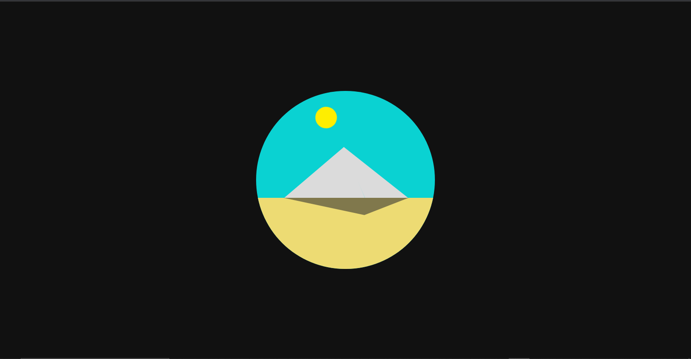
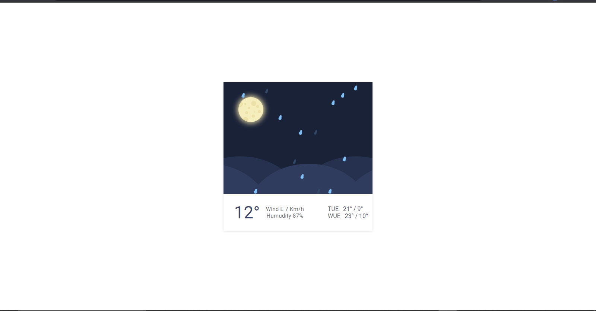
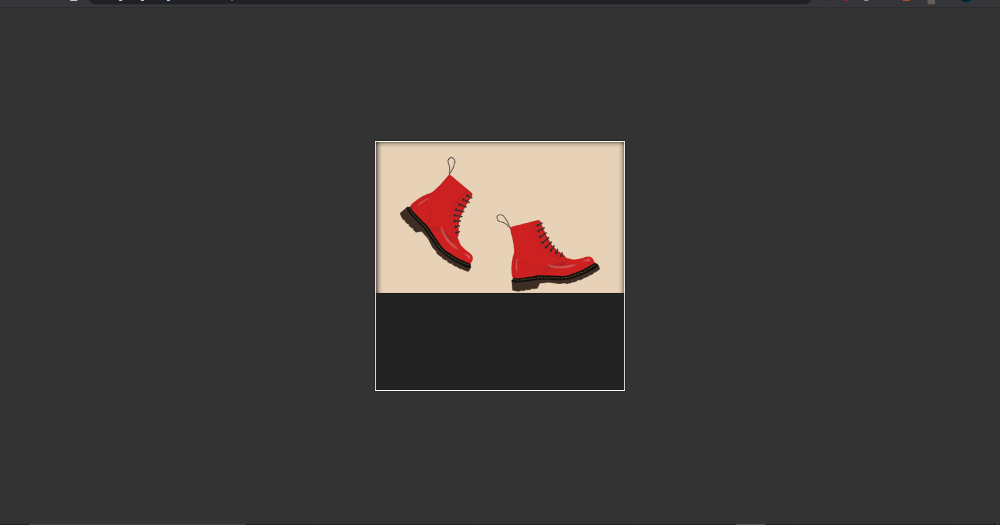

| Day 1 | Day 2 |
| ----------- | ----------- |
|  |  |
| [DEMO](https://miguelhg2351.github.io/100-days-css/01) | <a href="https://miguelhg2351.github.io/100-days-css/02">DEMO</a> |
| -webkit-fill-available, alternativa a fit-content | La función ```css rotate()``` |
| filter: progid:DXImageTransform.Microsoft.gradient | Animaciones |

- [fill-available](https://developer.mozilla.org/es/docs/Web/CSS/width)

- [filter: progid:DXImageTransform.Microsoft.gradient](https://docs.microsoft.com/en-us/previous-versions/windows/internet-explorer/ie-developer/platform-apis/ms532997(v=vs.85))

- [rotate](https://developer.mozilla.org/en-US/docs/Web/CSS/transform-function/rotate())

- [animation](https://developer.mozilla.org/es/docs/Web/CSS/animation)

------------

| Day 3 | Day 4 |
| ----------- | ----------- |
|  |  |
| [DEMO](https://miguelhg2351.github.io/100-days-css/03) | <a href="https://miguelhg2351.github.io/100-days-css/04">DEMO</a> |
| clip-path | scale |
| Cubic bezier | <- |
| Animaciones | <- |

- [clip-path](https://developer.mozilla.org/es/docs/Web/CSS/clip-path)

- [Cubic bezier](https://developer.mozilla.org/en-US/docs/Web/CSS/easing-function)

- [Animaciones](https://developer.mozilla.org/es/docs/Web/CSS/animation)

- [scale](https://developer.mozilla.org/es/docs/Web/CSS/transform-function/scale)

------------

| Day 5 | Day 6 |
| ----------- | ----------- |
|  |  |
| [DEMO](https://miguelhg2351.github.io/100-days-css/05) | <a href="https://miguelhg2351.github.io/100-days-css/06">DEMO</a> |
| Pseudo elementos | <- |
| Animaciones | <- |

- [Pseudo elementos](https://developer.mozilla.org/es/docs/Web/CSS/Pseudoelementos)

- [Animaciones](https://developer.mozilla.org/es/docs/Web/CSS/animation)

------------

| Day 7 | Day 8 |
| ----------- | ----------- |
|  |  |
| [DEMO](https://miguelhg2351.github.io/100-days-css/07) | <a href="https://miguelhg2351.github.io/100-days-css/08">DEMO</a> |
| Animaciones | <- |
| Pseudo elementos | <- |
| empty | Filter CSS |
| empty | SVG |
| empty | CSS y SVG |

- [SVG](https://developer.mozilla.org/es/docs/Web/SVG)

- [CSS y SVG](https://developer.mozilla.org/en-US/docs/Web/SVG/Tutorial/SVG_and_CSS)

- [Pseudo elementos](https://developer.mozilla.org/es/docs/Web/CSS/Pseudoelementos)

- [Animaciones](https://developer.mozilla.org/es/docs/Web/CSS/animation)

- [Filter CSS](https://developer.mozilla.org/es/docs/Web/CSS/filter)

------------

| Day 9 | Day 10 |
| ----------- | ----------- |
|  |  |
| [DEMO](https://miguelhg2351.github.io/100-days-css/09) | <a href="https://miguelhg2351.github.io/100-days-css/10">DEMO</a> |
| Animaciones | <- |
| Pseudo elementos | <- |
| empty | SVG |

- [SVG](https://developer.mozilla.org/es/docs/Web/SVG)

- [Pseudo elementos](https://developer.mozilla.org/es/docs/Web/CSS/Pseudoelementos)

- [Animaciones](https://developer.mozilla.org/es/docs/Web/CSS/animation)

------------

| Day 11 | Day 12 |
| ----------- | ----------- |
|  |  |
| [DEMO](https://miguelhg2351.github.io/100-days-css/11) | <a href="https://miguelhg2351.github.io/100-days-css/12">DEMO</a> |
| Animaciones | <- |
| Pseudo elementos | <- |
| Transform origin | <- |
| Transform | <- |

- [Pseudo elementos](https://developer.mozilla.org/es/docs/Web/CSS/Pseudoelementos)

- [Animaciones](https://developer.mozilla.org/es/docs/Web/CSS/animation)

- [Transform origin](https://developer.mozilla.org/en-US/docs/Web/CSS/transform-origin)

- [Transform](https://developer.mozilla.org/es/docs/Web/CSS/transform)

------------

| Day 13 | Day 14 |
| ----------- | ----------- |
|  |  |
| [DEMO](https://miguelhg2351.github.io/100-days-css/13) | <a href="https://miguelhg2351.github.io/100-days-css/14">DEMO</a> |
| Animaciones | <- |
| Pseudo elementos | <- |
| Transform origin | <- |
| Transform | <- |

- [Pseudo elementos](https://developer.mozilla.org/es/docs/Web/CSS/Pseudoelementos)

- [Animaciones](https://developer.mozilla.org/es/docs/Web/CSS/animation)

- [Transform origin](https://developer.mozilla.org/en-US/docs/Web/CSS/transform-origin)

- [Transform](https://developer.mozilla.org/es/docs/Web/CSS/transform)
